# Barber Shop

The [Barbershop Website](https://flashdrag.github.io/barber-shop) is a site for Successful Barbershop Business.

The website provides users with information about barbershop services and their cost. It's targeted toward people who are looking for a high quality haircut, beard trim or shave. Using a special form, the user can book a date and time for a haircut and/or other available service. After booking the service, user also can find the location of the Barbershop itself on the Google Map.
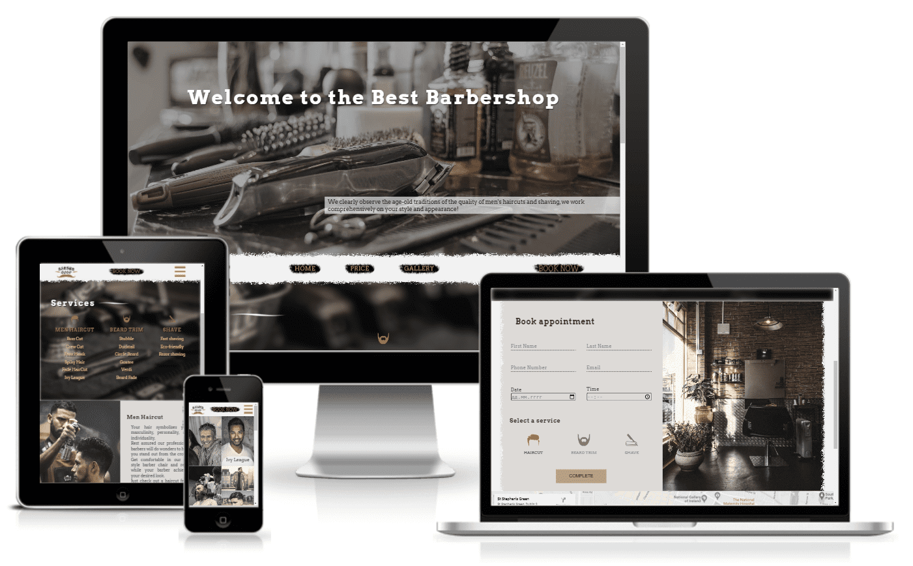

## Table of Contents

- [**Project Goals**](#project-goals)
  - [Bussiness Goals](#bussines-goals)
  - [User Goals](#user-goals)
- [**User Experience UX**](#user-experience-ux)
  - [Wireframes](#wireframes)
  - [Site Structure](#site-structure)
  - [Design Choices](#design-choices)
    - [Typography](#typography)
    - [Color Scheme](#color-scheme)
    - [Images](#images)
- [**Features**](#features)
  - [Home Page](#home-page)
    - [Header](#header)
    - [NavBar](#navigation-bar)
    - [Services](#services)
    - [Detail Services](#detail-services)
    - [Footer](#footer)
  - [BookNow Page](#booknow-page)
    - [Price List](#price-list)
    - [Book appoitment](#book-appointment)
    - [Map](#map)
  - [Gallery Page](#gallery-page)
- [**Technologies Used**](#technologies-used)

## Project Goals

### Bussines Goals

- Provide essential info about the business and services to customers.
- Automate the booking process by allowing customers to independently book the date and time of visiting the barbershop.
- Expand the client base and increase the credibility of the business, making it more and more popular.
- Promote business and increase the number of customers.
- Attract the attention of potential visitors.

### User Goals

- Find out information about the services provided and their prices.
- Find out the work schedule, contacts and the location of the barbershop itself.
- The ability to book an appointment through the site on their own.

[Back to top](#table-of-contents)

## User Experience (UX)

### Wireframes

The Barbershop Website was designed based on wireframes produced in [Balsamiq](https://balsamiq.com/). All design features were implemented.

| Index                                                                 | Book Now                                                                  |
| --------------------------------------------------------------------- | ------------------------------------------------------------------------- |
| 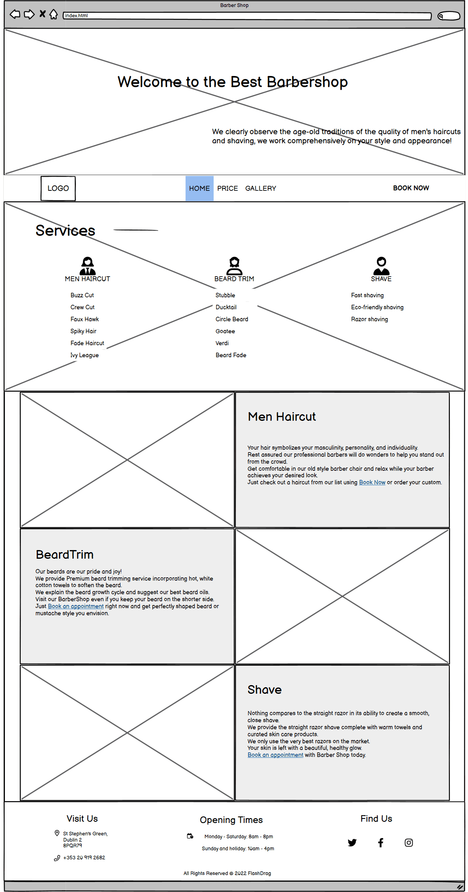 | 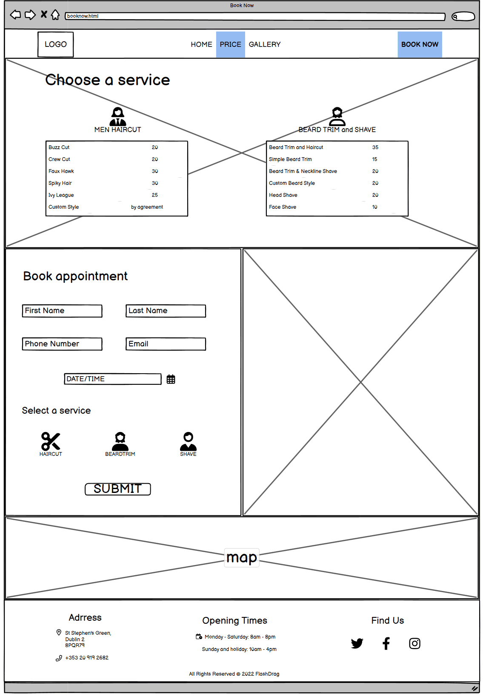 |

### Site Structure

The Barbershop site has three pages with a clear and semantic structure, the information is well organized, every element is easy to find. The consistency and similarity of the structure is manifested on all pages and sections of the site and covers interactivity. The main menu is designed with intuitive and familiar navigation which includes the barbershop logo on the left side, the navigation links in the center and the book now link on the right side.

### Design Choices

The website is designed in such a way as to interest the user, give useful information about the services and increase the chances of visiting the Barbershop. The appearance and UI design is quite user-friendly, stylish and responsive.

- #### Typography
  The main website font is a geometric slab-serif typeface family _Arvo_ and it's fallback font is _Serif_. The flavour of the font is rather mixed, being nearly monolinear to increase legibility.
  The font implemented on the website using [Google Fonts API](https://fonts.google.com). Heading weights are bold(700) and body text is regular(400).
- #### Color Scheme
  The colour scheme based on whitesmoke, warm yellow and brown tones and matches the images on the page.

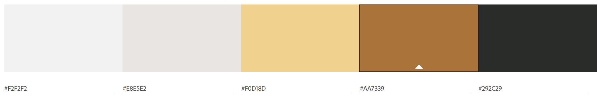

- #### Images
  Grunge borders, brush-stroke and logo were created in [Adobe Photoshop](https://www.adobe.com/products/photoshop.html) using paint brushes and other tools.
  All photos used in the project were downloaded from sources with a free license and do not require attribution. The images were colored and resized in [Adobe Lightroom](https://www.adobe.com/products/photoshop-lightroom.html) for a light moody style.
  All images were compressed using [IloveIMG](https://www.iloveimg.com/) online service to optimize site loading.

[Back to top](#table-of-contents)

## Features

The Barbershop website is designed to strictly adhere to accessibility guidelines across all pages/sections and all interactive elements.
Any interaction causes a positive response to the user through the semantic structured information, colors, clear and unambiguous navigation structures.
All external links open in another tab and use the noopener attributes to prevent external pages from being manipulated.

### Home Page

- #### Header
  The page header welcomes users, introduces barbershop and gives a brief overview of how it can be useful. The section is responsive for each screen size and occupies 70% of available browser space vertically.

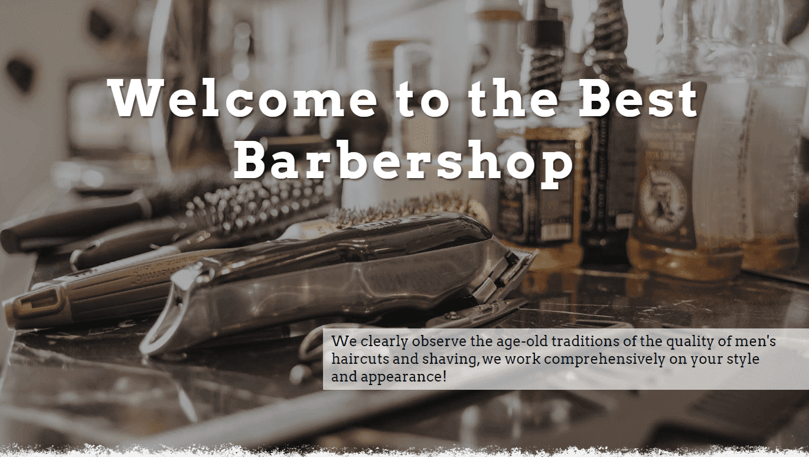

- #### Navigation Bar
  The navbar is sticky, fully responsive and changes to a toggler (hamburger menu) on smaller screens. It includes logo on the left side, the navigation links(home, price and gallery) in the center and the book now link on the right side. The background of each menu item is a brush stroke created in [Adobe Photoshop](https://www.adobe.com/products/photoshop.html) using a painting brush.
  Only the central part of the menu is hidden in the toggle at lower screen resolutions. The sticky menu is implemented in such a way that the "Book now" button is always visible to users, and they can make an appointment at any time without returning to the very top of the page.

|                       **Full NavBar**                        |                           **Mobile Navbar**                           |
| :----------------------------------------------------------: | :-------------------------------------------------------------------: |
| 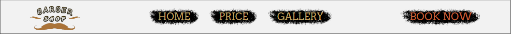 | 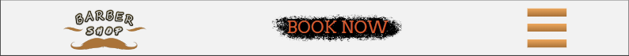 |
|                      **Sticky NavBar**                       |                          **Dropdown NavBar**                          |
|  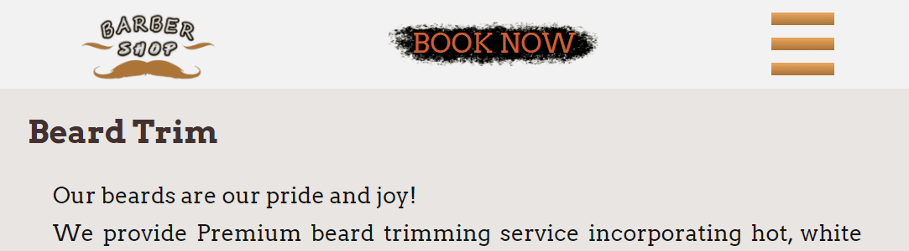  |         |

- #### Services
  This section presents three lists of services provided by the barbershop. Icons were used to attract the users eyes and allow them to quickly understand what type of service was being offered. On the big screen, the lists are arranged horizontally in 3 columns. On smaller devices, the services stack one on top of the other.

Desktop|Mobile
:-:|:-:
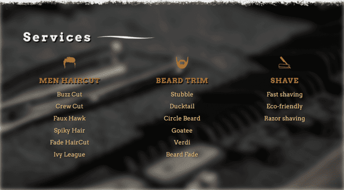|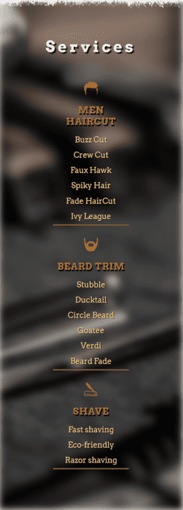

- #### Detail Services
  The section is implemented in the form of a chessboard on which pictures alternate with blocks of text. Each text block is supported by a picture and succinctly describes the main services to assure the user of what the company does and what is available. Also each block contains a link to the service booking page.

  On large screens, the section has a maximum horizontal limit size and is framed in a grunge border on the sides. The Grunge border was designed in [Adobe Photoshop](https://www.adobe.com/products/photoshop.html) using a painting brush. using painting brushes.

Desktop|Mobile
:-:|:-:
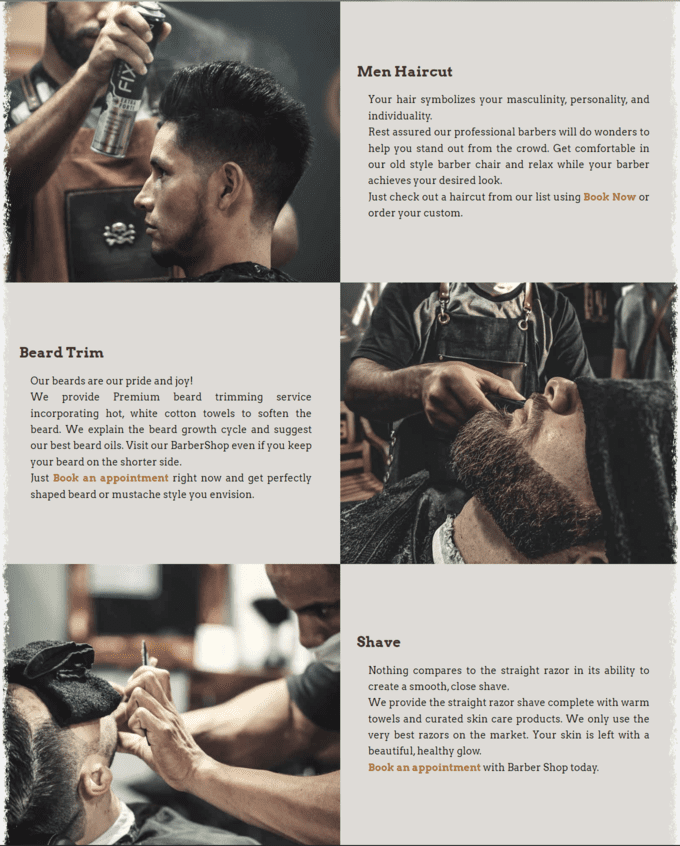|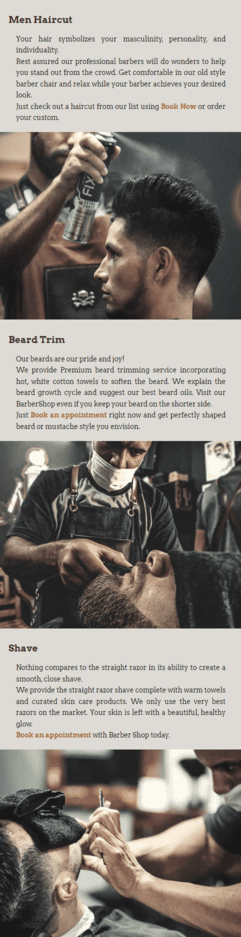

- #### Footer
  The footer is valuable to the user as it includes three blocks of useful info. This is address and phone number of the barbershop, opening times and links to the relevant social media sites.
  The footer section is also fully responsive and on smaller devices the info blocks stack one on top of the other.

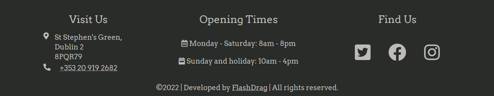

### BookNow Page

- #### Price List
  The Price List section consists of two columns containing the services provided and their cost. The user can access this page using the *Price* link on the navigation bar.

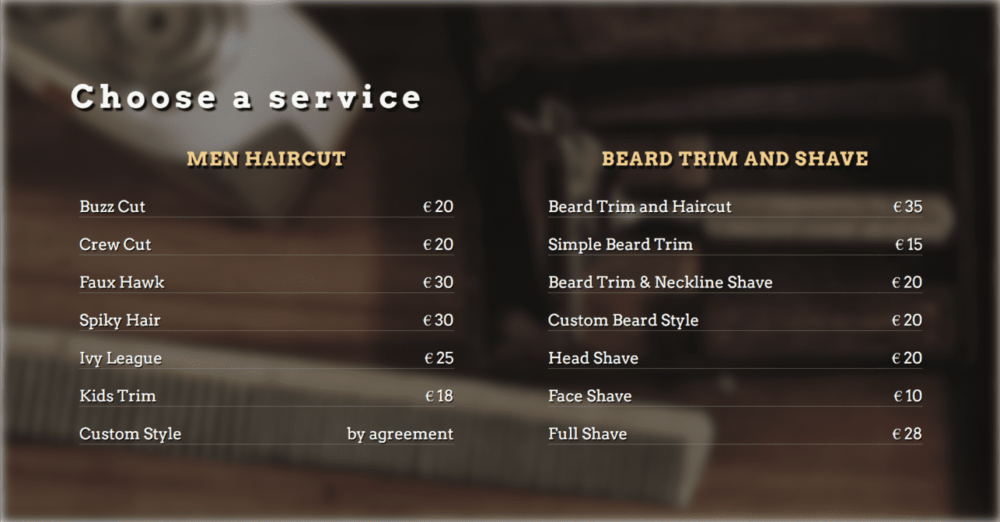

- #### Book appointment
  The [booking section](https://flashdrag.github.io/barber-shop/booknow.html#appoitment) horizontally divided on two blocks: booking form and image. On small devices the booking form occupies all available horizontal space. The booking form allows the user to select the desired service by simply clicking on one of the three icons. Also they can choose the date and time of visiting the barbershop. First Name, Last Name, Email, Date and Time are required.

  On large screens, the section has a maximum horizontal limit size and is framed in a grunge border on the sides. The Grunge border was designed in [Adobe Photoshop](https://www.adobe.com/products/photoshop.html) using a painting brush. using painting brushes.

Desktop|Mobile
:-:|:-:
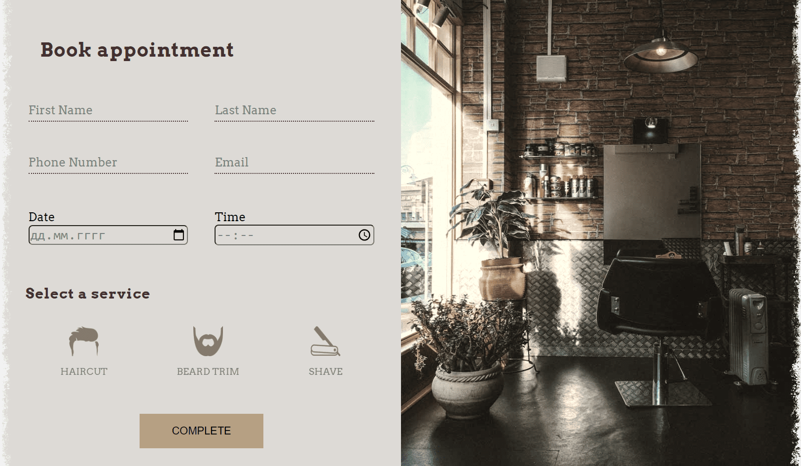 | 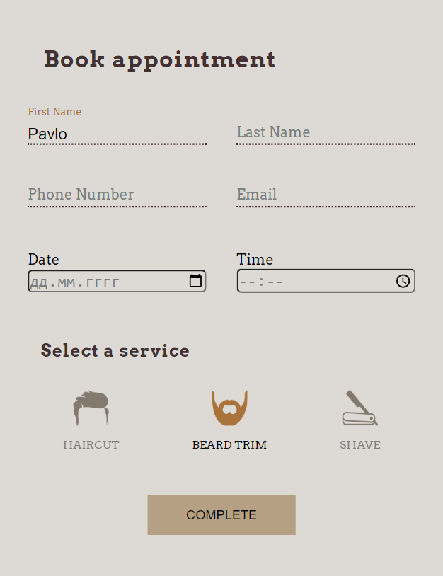

- #### Map
  The map is interactive and uses google api. The map is directly beneath the booking form and provides the user with the barbershop location. The map itself is embedded interactive [Google Map](https://maps.google.com) that allows the users to save the location to their navigation or get direction to the barbershop.
  The current map location was choosen for example.

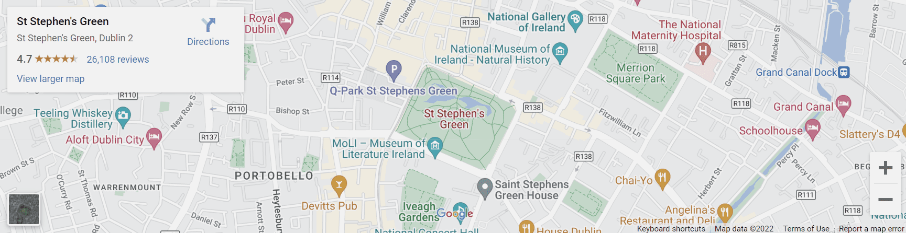

### Gallery Page
  The gallery allows the user to look at different styles of services provided. Imagery of the barbershop arranged a responsively styled grid. As the screen resolution decreases, the number of columns in the grid decreases, allowing to keep images large enough for comfortable viewing.
  Also hovering the mouse over any photo provides it's style name displayed at the bottom of the image.

Desktop | Mobile
:-:|:-:
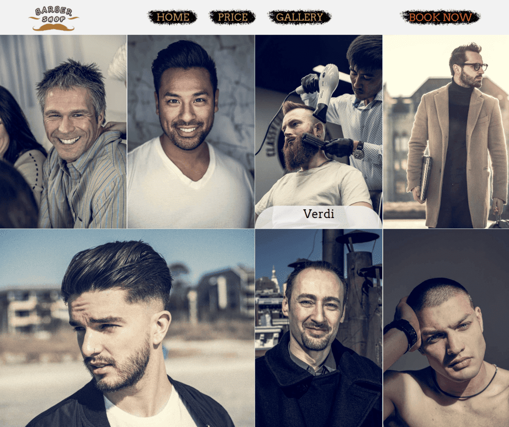 | 

[Back to top](#table-of-contents)

## Technologies Used
- [HTML5](https://developer.mozilla.org/en-US/docs/Glossary/HTML5) - building, structuring and presenting project
- [CSS3](https://developer.mozilla.org/en-US/docs/Web/CSS) - website styling
- [Balsamiq](https://balsamiq.com) - wireframes
- [Google Fonts](https://fonts.google.com) - fonts
- [FontAwesome](https://fontawesome.com), [Uxwing](https://uxwing.com) - icons
- [Adobe Photoshop](https://www.adobe.com/products/photoshop.html) - grange border, brush stroke, logo
- [Adobe Lightroom](https://www.adobe.com/products/photoshop-lightroom.html) - color grading, resizing
- [Google Map](https://maps.google.com) - map
- [Pexels](https://www.pexels.com), [Pixabay](https://pixabay.com), [StockSnap](https://stocksnap.io) - Free Stock Images
- [VScode](https://code.visualstudio.com) - code editing
- [GIT](https://git-scm.com/), [GitHub](https://github.com/) - tracking, storing, hosting project
- [iloveIMG](https://www.iloveimg.com) - image compressing and resizing
- [Chrome DevTools](https://developer.chrome.com/docs/devtools) - inspecting and debugging code

[Back to top](#table-of-contents)