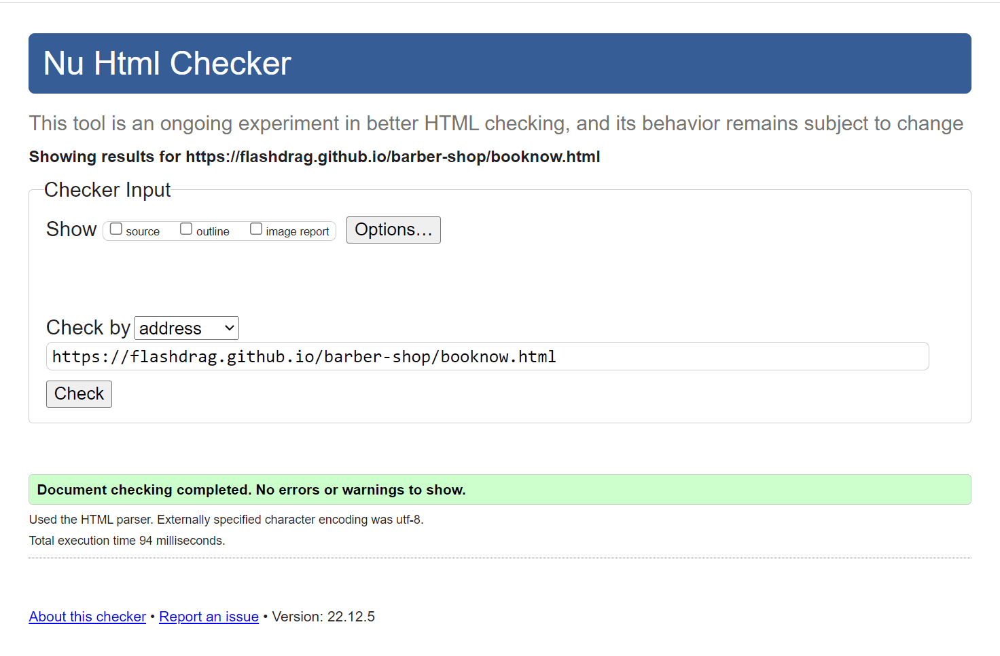
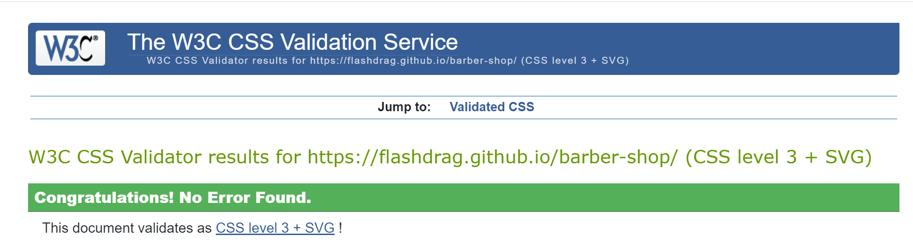
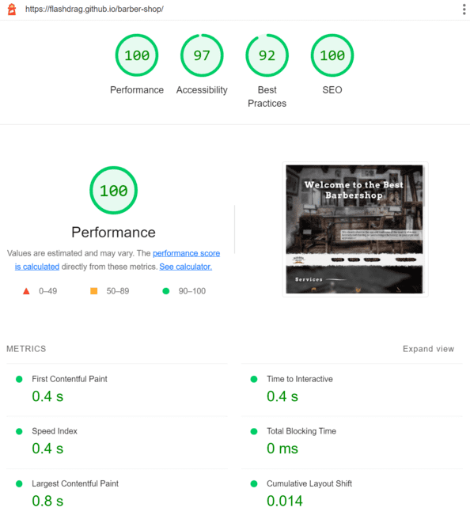
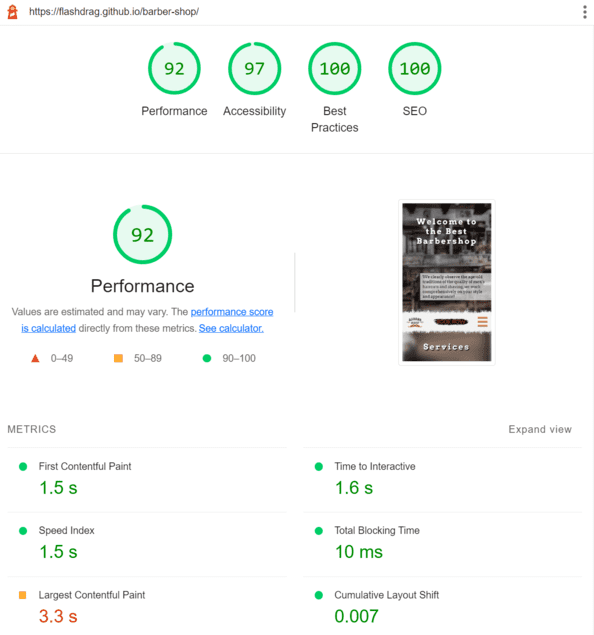
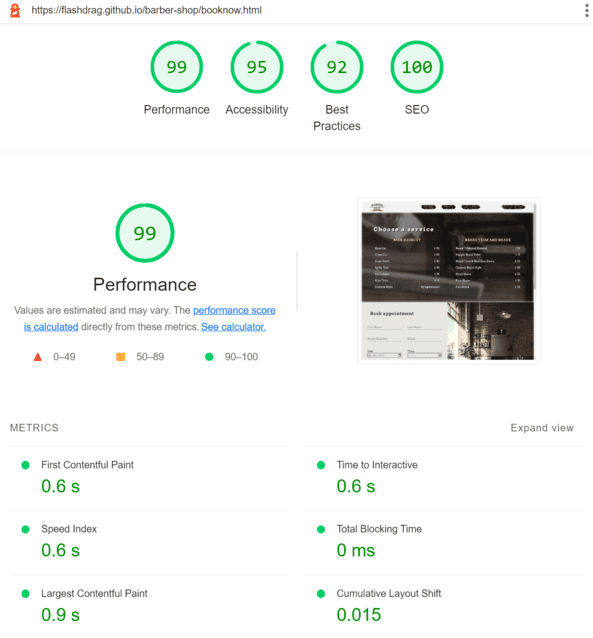
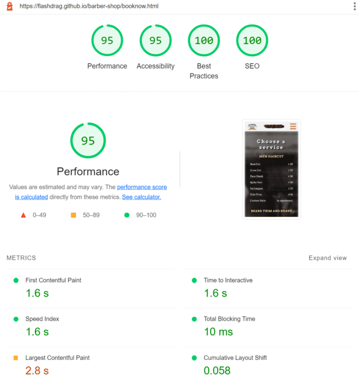
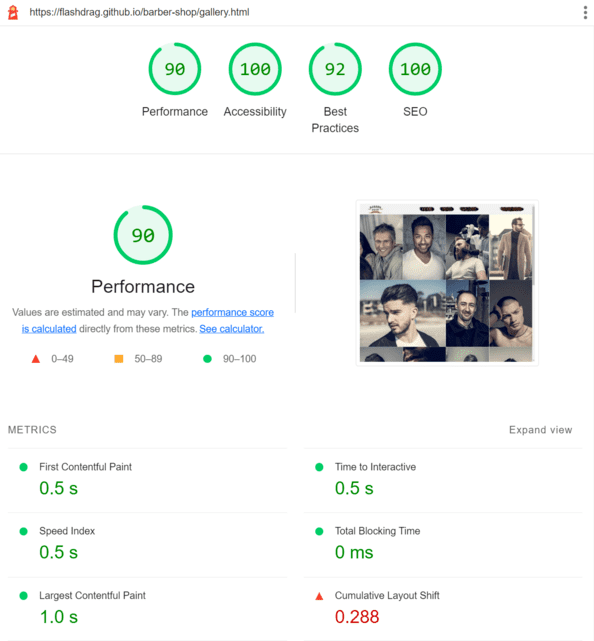
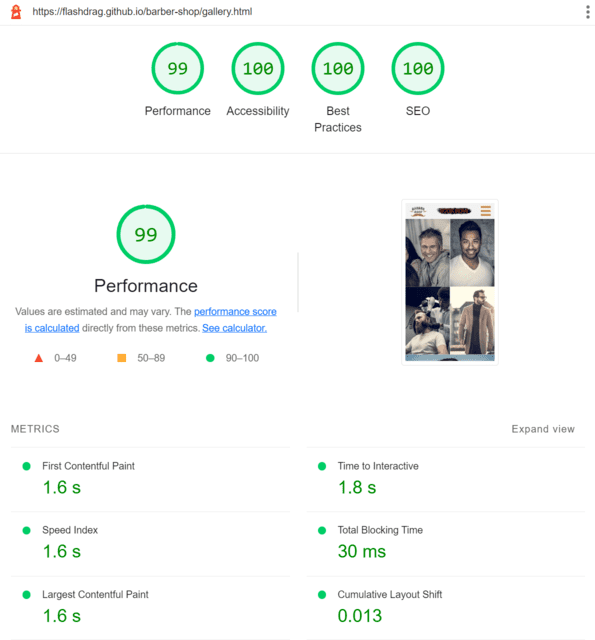

# Testing

## Contents

- [Functional Testing](#functional-testing)
    - [Home Page](#home-page)
    - [Form](#booking-page-form)
    - [Gallery](#gallery)
- [Compatibility Testing](#compatibility-testing)
    - [Browser Compatibility](#browser-compatibility)
    - [Device Compatability and Responsiveness Testing](#device-compatability-and-responsiveness-testing)
- [Validator Testing](#validator-testing)
    - [HTML Validation](#html-validation)
        - [Home page](#home-page-1)
        - [Booking page](#booking-page)
        - [Gallery page](#gallery-page)
    - [CSS Validation](#css-validation)
    - [Accessibility and Performance](#accessibility-and-performance)
        - [Home page](#home-page-2)
        - [Booking page](#booking-page-1)
        - [Gallery page](#gallery-page-1)
- [Bugs/Issues](#bugsissues)

## Functional Testing

- ### Home page
    Test | Result
    ---|:---:
    Page responsiveness | ok
    Sticky navbar | ok
    Navigation hover effect | ok
    Logo link back to homepage | ok
    Navigation links to relevant pages | ok
    Book Now link to booking form | ok
    Main menu collpases to a hamburger menu on small screen | ok
    Book an appointment in the service sections link to booking form | ok
    Social media icons in the footer link to the relevant social media and open in new tab | ok

- ### Booking page (Form)
    Test | Result
    ---|:---:
    Form responsiveness | ok
    Filling out the booking form | ok
    Service hover effect | ok
    Input field effects and animations | ok
    Selecting a service | ok
    Submiting the data | ok
    Returning form data from CodeInstitute API | ok

- ### Gallery
    Test | Result
    ---|:---:
    Imagery grid responsiveness | ok
    Image hover effect | ok

[Back to top](#contents)

## Compatibility Testing
### Browser Compatibility
The website was tested on the following browsers:
- Google Chrome
- Mozilla Firefox
- Microsoft Egde

The site worked well across all browsers and discrepancies were not found.

### Device Compatability and Responsiveness Testing
The website was tested using Google Chrome Developer Tool - Device Mode Toolbar.
#### Tested devices:
- iPhone SE
- iPhone XR
- iPhone 12 Pro
- Pixel 5
- Samsung Galaxy S8+
- Samsung Galaxy S20 Ultra
- iPad Air
- iPad Mini
- Surface Pro 7
- Surface Duo
- Galaxy Fold
- Samsung Galaxy A51
- Nest Hub
- Nest Hub Max

[Back to top](#contents)

## Validator Testing
### HTML Validation
The [W3C Markup Validation](https://validator.w3.org/) Service was used to validate the HTML of the website.
- #### Home Page
[*Click to re-validate this page*](https://validator.w3.org/nu/?doc=https%3A%2F%2Fflashdrag.github.io%2Fbarber-shop%2Findex.html)

- #### Booking Page
[*Click to re-validate this page*](https://validator.w3.org/nu/?doc=https%3A%2F%2Fflashdrag.github.io%2Fbarber-shop%2Fbooknow.html)

- #### Gallery Page
[*Click to re-validate this page*](https://validator.w3.org/nu/?doc=https%3A%2F%2Fflashdrag.github.io%2Fbarber-shop%2Fgallery.html)

### CSS Validation
The [W3C Jigsaw CSS Validation](https://validator.w3.org/) Service was used to check the CSS style sheet.

*Click to re-validate this page*

### Accessibility and Performance
The [Google Chrome LightHouse](https://developer.chrome.com/docs/lighthouse) was used to do the Web Accessibility and Performance Audit

> Since the initial performance results for mobile devices were around 90, all images were converted to .webp format using [XConvert](https://www.xconvert.com/compress-webp)

- #### Home Page
Desktop | Mobile
:-:|:-:
 | 

- #### Booking Page
Desktop | Mobile
:-:|:-:
 | 

- #### Gallery Page
Desktop | Mobile
:-:|:-:
 | 

[Back to top](#contents)

## Bugs/Issues

### Resolved

Issue|Fix
-|-
| In the booking form, in the last section of the service selection, the mouse hovering was causing a frame to appear around the label and icon. But the frame was slightly shifting the rest of the icons and the button.| In this regard, the frame was replaced with another hover effect. This is a text color changing for the label below the icons. As a result, this effect looks even more aesthetic than the frame.|
|Initially, the font size for almost every section was controlled separately, which worsened the overall control over font sizes for responsive design. | In order to automate and facilitate the process of managing font sizes, it was decided to globalize the font size and use the *em* unit for most fonts. In this case, it became possible to adjust the font size through the parent elements and moustly it was regulated in body element for responsive design. Also, the same font size was set for the same type of headings to maintain a similar design on all pages of the site.
|Bad contrast of service and price sections | Changed the font color from yellow to white in the service section to increase contrast and make this section more similar to the price section. In the price section, the background image was replaced to increase the contrast.|
|Initially, the dropdown menu would slide out from the top of the browser window and sometimes overlap the main navbar on the home page which is not pinned to the top of the window like it is on other pages. | It was decided to make the dropdown menu slide out on the right side and always just under the main navbar. But during development, another problem arose. Hiding the dropdown menu to the right side of the screen caused the horizontally scrolling of entire page, so the property *visibility* hide elements but they still takes up space on the page. In this regard, the side of hiding the dropdown menu was changed to the left side, which does not cause this bug.
|Sticky navigation bar on large screens on home page | *Sticky* navigation has been disabled for large screens and implemented mobile-only on all pages of the site to give the user constant access to the main menu and the *Book Now* link as the site gets much larger vertically on small screens. Thanks to my mentor Rory Patrick Sheridan for the suggestion.

### Unresolved
In order to get more performance in Lighthouse tests, optimize image loading speed and consume less cellular data, the main images were converted to the WebP format according to the recommendations [Performance Audits](https://developer.chrome.com/en/docs/lighthouse/performance/uses-webp-images/). But since WebP is a modern image format, it is not supported on some older device browsers. In this case, the site was tested on an iPhone 5s and the images were not displayed.

[Back to top](#contents)

[Back to README.md](https://github.com/FlashDrag/barber-shop/blob/master/README.md#testing)